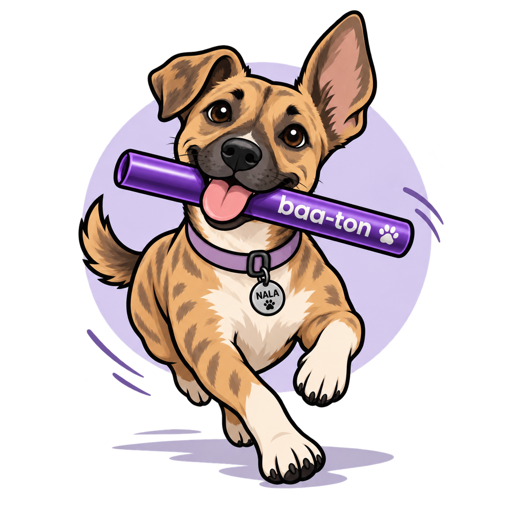

# Baa-ton

<p align="center">
  
</p>

Baa-ton is a Herdr-owned orchestration core with thin adapters for each coding-agent harness. Herdr owns the terminals and agent processes; Baa-ton coordinates their work.

It plans tasks into lanes, checks each agent's identity and launch profile before assigning work, routes questions and decisions, and records completion receipts. A local event controller wakes the parent when a lane needs attention. Shared state and recovery rules live in the core; adapters handle harness-specific launch arguments and startup evidence.

## Harness support

Pi, Claude Code, Codex, and OpenCode are live-qualified through one versioned launch contract. Every other harness fails closed by design, before creating terminals or assigning work.

Qualification covers the tested subscription profiles, not every model or configuration. Recovery and lifecycle integration still have rough edges. The [adapter notes](packages/herdr-tools/HARNESS-ADAPTERS.md) and [progress log](docs/native-prerequisite-progress.md) record evidence and limitations; older entries describe earlier states.

## Run the tests

Requires Node.js 20+. The current adapter tests also expect the harness CLIs on `PATH`.

```sh
npm install
npm test
```

The suite runs the workflow smoke check, workflow tests, and controller tests. For one package, use `npm run test:extension` or `npm run test:controller`. Local tests do not replace live harness qualification.

## Go deeper

- [Add a harness](docs/ADDING-A-HARNESS.md): implement the adapter and prove it works.
- [Workflow tools and MCP setup](packages/herdr-tools/README.md).
- [Event controller setup and behavior](packages/controller/README.md).
- [Launch contract and evidence](packages/herdr-tools/HARNESS-ADAPTERS.md).
