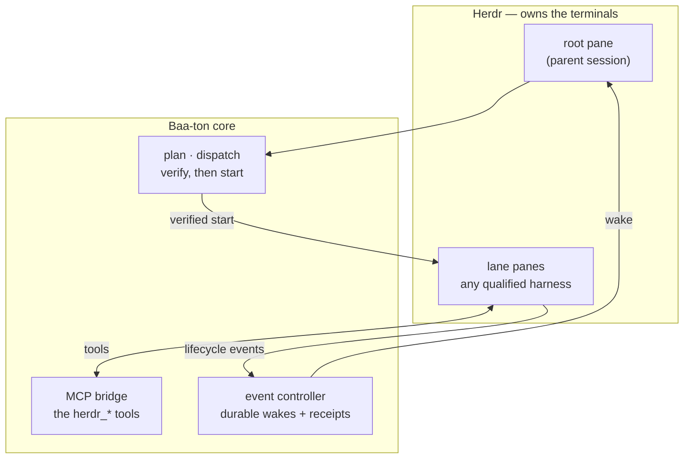
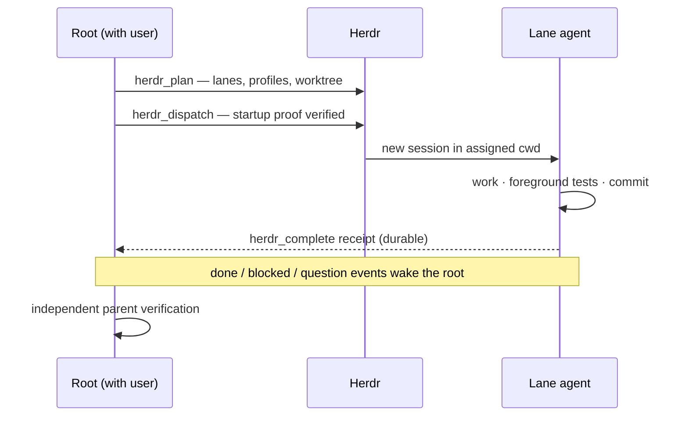

# Baa-ton

<p align="center">
  
</p>

Baa-ton is an orchestration core for [Herdr](https://github.com/herdrdev/herdr) (0.9+), the
terminal multiplexer for coding agents. Herdr owns the terminals and agent processes;
Baa-ton plans their work, verifies each agent before assigning it, and records what happened.

## Why Baa-ton

**What problem does it solve?** Running several coding agents is easy; trusting their
output is not. Baa-ton makes delegation *durable and verifiable* instead of
hope-and-scrollback.

- *"The agent said tests passed."* — Claims aren't receipts. A lane completes only by
  storing a durable `herdr_complete` receipt, and the parent independently re-runs the
  checks before accepting anything.
- *"My session died mid-round."* — Plans, lane assignments, events, and receipts live in
  transactional manifests. Reload or restart, and the round picks up from the ledger.
- *"Which of my six panes needs me?"* — The event controller wakes the parent only for
  actionable events (done, blocked, a question only you can answer). Post-completion
  noise is suppressed; `action-required` means *you* must act.
- *"Don't let it push to prod."* — Lanes are fenced per harness (interception, deny-rules,
  sandboxes). Push, merge, deploy, and resource closure always require the human.
- *"I want Codex to implement and Claude to review."* — One versioned contract, any
  qualified harness, heterogeneous lanes — with capability discovery instead of hoping
  a model/thinking level exists.

**Who is it for?** Anyone driving coding agents from a terminal through Herdr and wanting
parallel work they can actually trust.

**What it is not.** Not a daemon, not a hosted service, not CI. It never spawns processes
(Herdr does), and every harness that isn't explicitly qualified fails closed.

## What it does

- **Plans work into lanes** — one writer per worktree workflow, read-only lanes for review.
- **Verifies before assigning** — exact provider/model/thinking/auth, startup attestation, live capability discovery. Unverified harnesses fail closed *before* any terminal is created.
- **Bridges every harness** — all ten `herdr_*` tools over one MCP bridge.
- **Wakes the parent durably** — lifecycle events become durable wakes and receipts; nothing polls.

## Example prompts

You talk to a root session in a Herdr pane; Baa-ton does the rest. Real shapes that work today:

**Delegate one bounded task**

```text
Close the failing tests in packages/controller — delegate to a luna lane
in a worktree and verify it yourself before we merge.
```
→ The root plans a single-lane workflow (BB-029 local scope), dispatches it after startup
proof, the lane works/tests/commits and files its receipt, the root re-runs the suite and
reports evidence.

**Run a parallel round**

```text
Close these three gaps. Parallelize the disjoint ones, sequence the ones
that share files, and have Claude review the whole diff before we push.
```
→ One workflow per writer over separate worktrees, parent verification between lanes,
then a read-only cross-vendor review lane. No push without your explicit gate.

**Answer a lane's question**

```text
(the lane hit a decision) → you get woken with the question
Pick option 2 — reuse the existing adapter.
```
→ Questions persist durably and route to the mapped root; your answer is recorded and
delivered to the waiting lane. Lanes never prompt their own UI.

## Supported harnesses

| Harness | Adapter | Live qualification | Tested with | Notes |
| --- | --- | --- | --- | --- |
| Pi | `pi-launch-adapter.ts` | 2026-09-15, several lanes | pi 0.85.1 | First-class: native tools, bash interception, can host the root |
| Claude Code | `claude-launch-adapter.ts` | 2026-09-15, durable-core + review lanes | claude 2.1.273 | Deny-rules (push/merge/PR), SessionStart attestation |
| Codex | `codex-launch-adapter.ts` | 2026-09-15, messaging-core lane | codex-cli 0.154.0 | Sandbox can't write worktree git metadata; no MCP respawn (dead bridge orphans lane tools) |
| OpenCode | `opencode-launch-adapter.ts` | 2026-09-15, goals/profiles lane | opencode 1.18.31 | READY handshake auto-sent, conservative bash permissions |
| Anything else | — | Fails closed | — | By design, before topology is created |

Qualification covers the tested subscription profiles, not every model or configuration.
Recovery and lifecycle integration still have rough edges — see the
[progress log](docs/native-prerequisite-progress.md) for evidence and limitations.

## How it fits together



Read it as one loop: the root plans and dispatches through the core, lanes are
started only after verification, lanes use the bridge for tools, their events feed
the controller, and the controller wakes the root.

A delegation round looks like this:



Parallel writers get one workflow per worktree with disjoint file ownership; lanes that
share files are sequenced. Integration is the parent's job: land linearly, re-run the
merged suite, cross-vendor review before shipping.

## Quick start

Requires Node.js 20+, Herdr 0.9.0+, and (for adapter tests) the harness CLIs on `PATH`.

```sh
npm install
npm test
```

The suite runs the workflow smoke check, workflow tests, and controller tests. For one
package: `npm run test:extension` or `npm run test:controller`. Local tests do not
replace live harness qualification.

## Go deeper

- [Design philosophy](docs/DESIGN-PHILOSOPHY.md) — enforced interface, truthful capabilities, fail closed.
- [Add a harness](docs/ADDING-A-HARNESS.md) — implement the adapter and prove it works.
- [Launch contract and evidence](packages/herdr-tools/HARNESS-ADAPTERS.md) — the versioned adapter contract.
- [Workflow tools and MCP setup](packages/herdr-tools/README.md) — planning, parallel lanes, worktrees.
- [Event controller](packages/controller/README.md) — durable wakes, receipts, goal statuses.
- [Progress log](docs/native-prerequisite-progress.md) — evidence, qualifications, open gaps.
