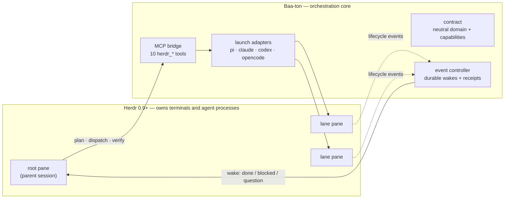
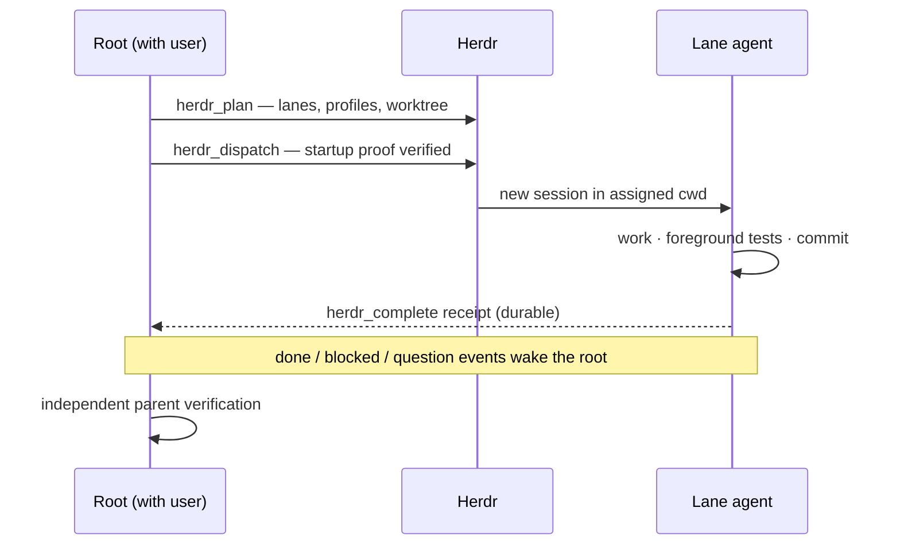

# Baa-ton

<p align="center">
  
</p>

Baa-ton is an orchestration core for [Herdr](https://github.com/herdrdev/herdr) (0.9+), the
terminal multiplexer for coding agents. Herdr owns the terminals and agent processes;
Baa-ton plans their work, verifies each agent before assigning it, and records what happened.

## What it does

- **Plans work into lanes** — one writer per worktree workflow, read-only lanes for review.
- **Verifies before assigning** — exact provider/model/thinking/auth, startup attestation, capability discovery. Unverified or unregistered harnesses fail closed *before* any terminal is created.
- **Bridges every harness** — all ten `herdr_*` tools (plan, dispatch, complete, observe, …) over one MCP bridge.
- **Wakes the parent durably** — an event controller turns lane lifecycle events into durable wakes and completion receipts; nothing relies on polling.

## Supported harnesses

| Harness | Adapter | Live qualification | Tested with | Notes |
| --- | --- | --- | --- | --- |
| Pi | `pi-launch-adapter.ts` | 2026-09-15, several lanes | pi 0.85.1 | First-class: native tools, bash interception, can host the root |
| Claude Code | `claude-launch-adapter.ts` | 2026-09-15, durable-core + review lanes | claude 2.1.273 | Deny-rules (push/merge/PR), SessionStart attestation |
| Codex | `codex-launch-adapter.ts` | 2026-09-15, messaging-core lane | codex-cli 0.154.0 | Sandbox can't write worktree git metadata; no MCP respawn (dead bridge orphans lane tools) |
| OpenCode | `opencode-launch-adapter.ts` | 2026-09-15, goals/profiles lane | opencode 1.18.31 | READY handshake auto-sent, conservative bash permissions |
| Anything else | — | Fails closed | — | By design, before topology is created |

Qualification covers the tested subscription profiles, not every model or configuration.
Recovery and lifecycle integration still have rough edges — see the
[progress log](docs/native-prerequisite-progress.md) for evidence and limitations.

## How it fits together



A delegation round looks like this:



Parallel writers get one workflow per worktree with disjoint file ownership; lanes that
share files are sequenced. Integration is the parent's job: land linearly, re-run the
merged suite, cross-vendor review before shipping.

## Quick start

Requires Node.js 20+, Herdr 0.9.0+, and (for adapter tests) the harness CLIs on `PATH`.

```sh
npm install
npm test
```

The suite runs the workflow smoke check, workflow tests, and controller tests. For one
package: `npm run test:extension` or `npm run test:controller`. Local tests do not
replace live harness qualification.

## Go deeper

- [Design philosophy](docs/DESIGN-PHILOSOPHY.md) — enforced interface, truthful capabilities, fail closed.
- [Add a harness](docs/ADDING-A-HARNESS.md) — implement the adapter and prove it works.
- [Launch contract and evidence](packages/herdr-tools/HARNESS-ADAPTERS.md) — the versioned adapter contract.
- [Workflow tools and MCP setup](packages/herdr-tools/README.md) — planning, parallel lanes, worktrees.
- [Event controller](packages/controller/README.md) — durable wakes, receipts, goal statuses.
- [Progress log](docs/native-prerequisite-progress.md) — evidence, qualifications, open gaps.
